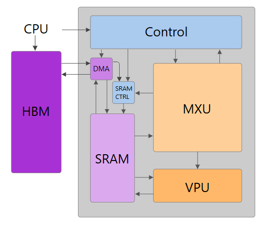
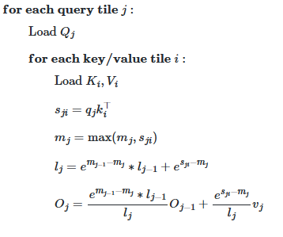
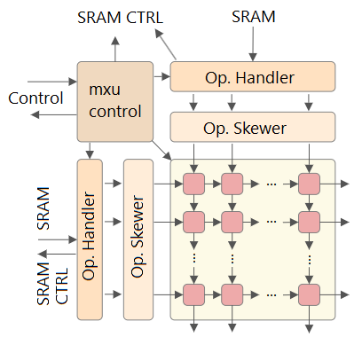

# Architectural decisions for FlashAttention acceleration
#### By Paulo Dietrich, July 29 2026

# Overview
This system is a FlashAttention [1] Accelerator targeting the basys3 [2] board designed as a learning experiment and intro 
to transformers accelerators. It uses a single output-stationary systolic array pass with the goal of computing:

$$
O = \text{softmax}(QK^\top)V
$$

# Architecture
The design consists of 6 main modules: Controller, DMA, SRAM Controller, SRAM, Matrix Multiplication Unit (MXU), Vector Processing Unit
(VPU). The design runs on a quantized INT8 model, with convertion for FXP12 for the VPU.

## Control
Is responsible for the communication between the CPU and the accelerator. It also sends DMA requests, MXU requests and acts as a tile scheduler. 

It aims to implement the following algorithm

### Interface
#### INPUTS
|signal name  |Description|
|--|--|
|fa_start     |Start FlashAttention computation|
|sq_len     |Token sequence length|
|dma_done|Full data transfer between HBM and SRAM done|
|mxu_done   |Signal GEMM done|

#### OUTPUTS
|signal name  |Description|
|--|--|
|fa_done    |Computation done|
|mxu_start  |Start the GEMM systolic array|
|mxu_cmd    |Pass dimensions M, N, K of the M x K x N GEMM, row and column offset for tiled matmul|
|dma_rq     |Pass number of active channels, Transfer direction, Transpose, Base address, Destination address, Byte count|

## MXU

This module is responsible for intaking 2 matrices A and B with respective $M \times K$ and $K \times N$ dimensions and produce an $M \times N$ output. The precisions of the operands are INT8, and the accumulator has INT32 precision. 

Additionaly, it also outputs the maximum `row_max` and sum `row_sum` per row at every cycle. (`row_sum` still to be implemented)

The latency for an output-stationary (OS) $M \times K \times N$ can be defined by the following formula [3]:

$$
T_{cyc} = 2M + N + K -2
$$

However, to account for the internal DSP latency [4] and computation of `row_max` and `row_sum`, `DSP_LAT` and another instance of `N` must be added. Thus, the total latency for the computation is given by:

$$
T_{cyc} = 2M + 2N + K -2 + \text{DSP_LAT}
$$

### Control
Finite state machine controlling `m_IDLE`, `m_CLEAR`, `m_STREAM`, `m_DRAIN` and `m_DONE` states. Latches `mxu_cmd` and controls which dimension `k_idx` is being fetched from the SRAM and when to stop fetching. Also instantiates a counter for cycle-acurate detection of when the GEMM is complete, which is when `counter == T_cyc`.

|state  |description|
|-|-|
|m_IDLE|Waits for `mxu_start`|
|m_CLEAR|Cleans all residual PEs and sets the starting `k_idx` to be fetched for each input matrix|
|m_STREAM|Enables the systolic array, tells the SRAM buffer it is being read, and increments `k_idx` while `k_idx < K`, and then moves on|
|m_DRAIN|Stops reading from the SRAM and 0s are streamed through the array, which keeps computing until the GEMM is complete|
|m_DONE|Outputs `mxu_done` and goes to `m_IDLE`|

### Operand Handler
Forwards the index request to the SRAM_CTRL, where it is translated into an address and slices the incoming bus of operands.

### Operand Skewer
Receives one full operand dimension per cycle, and skews line `i` by `i cycles` using shift registers.

### Systolic Array

Computes the output-stationary GEMM $C =A \times B$ using a grid of `SA_ROWS` by `SA_COLS` Processing Elements (PE), connected by a fabric. Matrix A is fed from left to right, while matrix B is fed top to bottom, and the output accumulator is stationary to each processing element. 
The design uses an output-stationary dataflow, enabling the computation of an $M \times N$ tile for any $K$ dimension in an $M \times K \times N$ matrix multiplication using only $M \times N$ processing elements. Since $K \gg M \mid N$, this approach reduces hardware utilization by reducing the number of required processing elements or tiles. The main tradeoff is that the tile $Q_j$ requires a dedicated SRAM buffer to allow it to be streamed for each GEMM operation instead of storing the weights locally within the PEs. This design choice is particularly suitable for resource-constrained boards such as the Basys3, where DSP resources are limited and memory is comparatively abundant.

#### Processing Element (PE)
Intakes `in_a` and `in_b` and computes `c = c + (in_a * in_b)`, and also evaluates wether the forwarded result from the left processing element is greater than the accumulator of this PE, and forwards the larger one to the next PE on the right.

## VPU
Has the goal of applying the online softmax algorythim to the Attention Score $S$ produced by the MXU.

It does it by updating the three statistics $m_j$, $l_j$ and $o_j$ for each $j$ row, as refered in the algorithm image. 

It converts $S$ to FXP12 precision, and implements the $e^x$ function using CompressedLut [5]

## SRAM
Unified SRAM buffer for storing the $Q_j$, $K_j$, $V_j$ and $O_j$ tiles on chip. (V and O to be added)

It uses a double-buffer approach to allow for simultaneous fill and feed of matrices. Only the SRAM Controller knows of the existence of the double buffers, controlling when they switch. 

### Interface
#### INPUTS
|signal name  |Description|
|--|--|
|din_A a and b, dinB a and b. TBA: din_C, din_D   |32 bit input data buses|
|bufA_wr_addr a and b, bufB_wr_addr a and b. TBA bufC_wr_addr a and b, bufD_wr_addr a and b    |Write addresses|
|bufA_rd_addr a and b, bufB_rd_addr a and b. TBA bufC_rd_addr a and b, bufD_rd_addr a and b|Read addresses|
|bufA_rd_ram, bufB_rd_ram. TBA bufA_rd_ram, bufB_rd_ram|Select which BRAM is being read in the double buffer (0 = RAM0, 1 = RAM1)|

#### OUTPUTS
|signal name  |Description|
|--|--|
|bufA_dout a and b, bufB_dout a and b. TBA bufC_dout a and b, bufD_dout a and b|32 bit output data busses|

## SRAM Controller
Is responsible for generating the read addresses for the Operand Handler and for controlling the double-buffers. They switch once for every time that the DMA finishes writing and if they are not being read at the moment, with the exception of buffer A, that switches only when a new Q tile will be computed. 

## DMA (To be Implemented)
It is responsible for data transfers between the HBM and the SRAM via an AXI4 interface. It decodes `dma_rq` and may or may not transpose depending on the transpose bit. 

**Why transpose?** 
In the HBM, the matrices are stored row-major, meaining that consecutive addresses will store the dimensions of the same $\text{row[j]}$ . Thus, the base address of $\text{row[j]}$ inside a buffer is given by:

$$
\text{base_addr_row[j]} = \frac{d}{\text{dim_per_addr}}*j
$$

However, the systolic array needs all `SA_ROWS` and `SA_COLS` dimension `i` at the same cycle. Thus, it is more efficient if the buffers that feed `Q` and `i` to the systolic array are column major, meaning that consecutive address will store the rows of the same dimension `i`. Thus, the base address of dimension `i` inside a buffer is given by:

$$
\text{base_addr_dim[i]} = \frac{\text{sa_lines}}{\text{dim_per_addr}}*i
$$

Thus, buffers A and B, which store Q and K will be column-major, and buffers C and D, which store V and O, will be row_major.

# Future steps

## V1
- Design VPU
- Design Central Control FSM
- Design DMA
- Integrate and test
- Add UART interface with CPU (For simplicity of testing and debugging)
- Implement and run on basys. 

## V2
- Unify SRAM addressing space
- Change precision from INT8 to BF16

## V3
- Scale from Basys3 to Alveo U50 with PCIe communication and real HBM2 integration, supporting larger models and arrays (from 8x8 to 64x64)

# References
[1] T. Dao, D. Y. Fu, S. Ermon, A. Rudra, and C. Ré, *FlashAttention: Fast and Memory-Efficient Exact Attention with IO-Awareness*, Advances in Neural Information Processing Systems 35 (NeurIPS 2022), 2022. [Online]. Available: [https://arxiv.org/abs/2205.14135](https://arxiv.org/abs/2205.14135)

[2] Digilent, *Basys3 FPGA Board Reference Manual*, Rev. C, Aug. 12, 2014. [Online]. Available: [AMD Documentation](https://www.amd.com/content/dam/amd/en/documents/university/aup-boards/XUPBasys3/documentation/Basys3_rm_8_22_2014.pdf)

[3] A. Samajdar, J. M. Joseph, Y. Zhu, P. Whatmough, M. Mattina, and T. Krishna, A Systematic Methodology for Characterizing Scalability of DNN Accelerators using SCALE-Sim, in Proc. IEEE Int. Symp. on Performance Analysis of Systems and Software (ISPASS), 2020. [Online]. Available: https://horizon-lab.org/pubs/ispass20.pdf

[4] AMD (Xilinx), *7 Series DSP48E1 Slice User Guide*, UG479 v1.10, 2018. [Online]. Available: [AMD Documentation](https://docs.amd.com/v/u/en-US/ug479_7Series_DSP48E1)

[5] Khataei, Alireza and Bazargan, Kia. *CompressedLUT: An Open Source Tool for Lossless Compression of Lookup Tables for Function Evaluation and Beyond*. FPGA '24, 2024.  
https://doi.org/10.1145/3626202.3637575