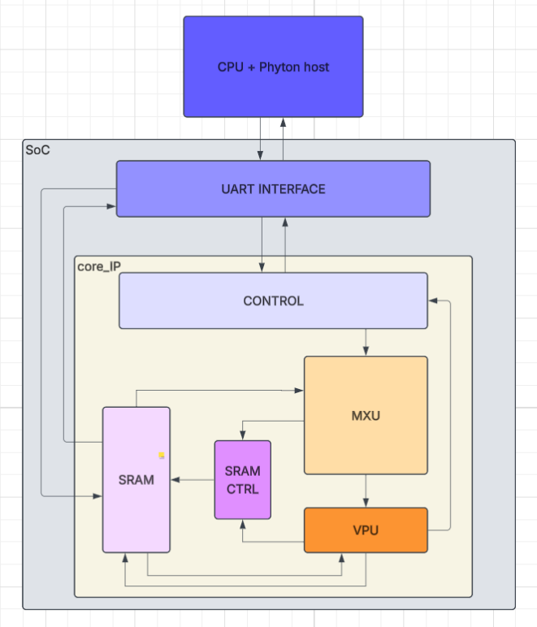

# FlashAttention FPGA Accelerator Architecture

## 1. Overview

This project implements a tiled attention accelerator targeting the Digilent Basys 3 FPGA development board. The design is intended as an educational hardware implementation of the core ideas behind FlashAttention: decomposing attention into on-chip tiles and maintaining running softmax statistics so that the complete $N \times N$ attention matrix does not need to be materialized in memory [1].

For a single attention head, the target operation is

$$
O = \text{softmax}(QK^T)V
$$

where $Q$, $K$, and $V$ contain the query, key, and value vectors respectively.

The accelerator uses an **8×8 output-stationary systolic array** to compute tiled $QK^T$ products and a **Vector Processing Unit (VPU)** to incrementally update the softmax state and accumulate the corresponding $V$ vectors. The implementation operates on INT8 input operands with INT32 matrix-multiplication accumulators.

The current Basys 3 implementation is a self-contained proof-of-concept system. Q, K, and V are transferred from a host PC through the board's USB-UART interface into four on-chip BRAM banks. Computation then proceeds entirely on the FPGA before the resulting O matrix is read back by the host.

The current implementation deliberately does **not** contain a DMA engine, external DRAM/HBM interface, or memory/compute double buffering. Those features belong to future versions targeting larger FPGA platforms.

---

## 2. Design Goals

The architecture is designed around three primary constraints:

1. **Demonstrate tiled attention in RTL.**  
   The design exposes the interaction between GEMM acceleration, tiled execution, online softmax, local memory, and system-level control rather than treating attention as a monolithic arithmetic block.

2. **Fit a resource-constrained FPGA.**  
   The Basys 3 uses an AMD/Xilinx Artix-7 XC7A35T FPGA containing 90 DSP slices and 1,800 Kbits of block RAM [2]. This strongly influences the 8×8 systolic-array geometry and the extensive reuse of arithmetic hardware inside the VPU.

3. **Provide a complete host-to-accelerator path.**  
   The accelerator can receive Q/K/V matrices from a PC, execute attention, and return O without requiring an embedded processor or external memory controller.

The design therefore prioritizes architectural clarity and resource reuse over maximum throughput.

---

## 3. System Architecture

At the highest level, the system consists of the following blocks:



The hardware hierarchy is:

```text
basys3_top
└── fa_uart_top
    ├── uart_rx
    ├── uart_tx
    ├── uart_command
    └── fa_top
        ├── attention_ctrl
        ├── mxu
        │   ├── mxu_ctrl
        │   ├── mxu_op_handler
        │   ├── mxu_op_skewer
        │   └── mxu_systolic_array
        │       └── pe × 64
        ├── vpu
        │   ├── vpu_v_fetch
        │   └── vpu_row
        │       ├── exp
        │       ├── rcp
        │       └── scl
        ├── sram_ctrl
        │   └── rd_addr_gen
        ├── o_writer
        └── sram
            └── bram × 4
```

---

## 4. Architectural Parameters

The current RTL defines the following accelerator geometry:

| Parameter | Value | Description |
|---|---:|---|
| `OPERAND_W` | 8 | Q/K/V/O operand width |
| `ACC_W` | 32 | MXU and VPU accumulator width |
| `D_MODEL` | 16 | Embedding dimension |
| `SA_ROWS` | 8 | Systolic-array rows |
| `SA_COLS` | 8 | Systolic-array columns |
| `BATCH_SIZE` | 8 | Tokens processed per Q/K tile |
| `BUF_PORT_W` | 32 | BRAM interface width |
| `NUM_PORTS` | 2 | Memory ports used by compute path |
| `BUF_DEPTH` | 1024 | 32-bit words per memory bank |
| `NUM_BUF` | 4 | Q, K, V, and O memory banks |
| `MAX_TOKENS` | 256 | Maximum supported sequence length |

Each 32-bit memory word therefore contains four INT8 operands.

Valid sequence lengths are non-zero multiples of eight up to 256 tokens.

---

# 5. Attention Tiling Strategy

For sequence length $N$ and embedding dimension $d=16$,

$$
Q,K,V \in \mathbb{Z}^{N \times 16}.
$$

The accelerator divides the sequence dimension into groups of eight tokens:

$$
B = \frac{N}{8}.
$$

Each Q batch is compared against every K/V batch.

For Q batch $i$ and K/V batch $j$, the MXU computes

$$
S_{ij}=Q_iK_j^T
$$

with

$$
Q_i\in\mathbb{Z}^{8 \times 16},
$$

$$
K_j^T\in\mathbb{Z}^{16 \times 8},
$$

producing

$$
S_{ij}\in\mathbb{Z}^{8 \times 8}.
$$

The controller therefore executes

$$
B^2
$$

MXU/VPU operations for a complete attention request.

Importantly, the full $N \times N$ score matrix is never required as an intermediate on-chip structure. Each 8×8 score tile is consumed by the VPU before the next K/V tile is processed.

This follows the central IO-aware motivation of FlashAttention: attention can be evaluated in tiles while maintaining sufficient softmax statistics instead of repeatedly materializing the complete attention matrix in a larger memory hierarchy [1].

---

# 6. Attention Controller

`attention_ctrl` is the top-level compute scheduler.

It maintains two indices:

- `q_batch_idx`
- `kv_batch_idx`

and generates one MXU command for every pair of Q and K/V batches.

Its state machine contains four states:

| State | Function |
|---|---|
| `fa_IDLE` | Wait for a valid `start` request |
| `fa_SEND_CMD` | Construct the next 8×16 × 16×8 MXU command |
| `fa_COMPUTE` | Wait for the corresponding VPU operation to complete |
| `fa_DONE` | Signal completion and return to idle |

For every operation, the controller programs

```text
M = 8
N = 8
K = 16
```

while changing the Q and K/V sequence offsets.

Conceptually:

```text
for q_batch = 0 .. B-1:
    for kv_batch = 0 .. B-1:
        S = Q[q_batch] × K[kv_batch]^T
        update_online_softmax(S, V[kv_batch])
```

The VPU preserves the running softmax state while `kv_batch_idx` advances. When the first K/V tile for a new Q batch is issued, `first_kv` resets the running state.

---

# 7. Matrix Multiplication Unit

The Matrix Multiplication Unit (MXU) computes

$$
C=AB
$$

for an $M \times K$ matrix A and $K \times N$ matrix B.

For attention, its configured dimensions are

$$
(8 \times 16)(16 \times 8) \rightarrow (8 \times 8).
$$

The MXU consists of four major components:

1. MXU controller
2. Operand handler
3. Operand skewer
4. 8×8 systolic array

Systolic arrays use a regular two-dimensional network of processing elements in which operands propagate locally between neighboring PEs. This permits data reuse without repeatedly accessing SRAM for every multiply-accumulate operation [3].

---

## 7.1 MXU Controller

`mxu_ctrl` controls the lifetime of one GEMM operation.

Its FSM contains:

| State | Description |
|---|---|
| `m_IDLE` | Wait for `mxu_start` |
| `m_CLEAR` | Clear PE accumulators and initialize operand indices |
| `m_STREAM` | Read operands and stream valid Q/K dimensions into the array |
| `m_DRAIN` | Stop memory reads while allowing the systolic wavefront to finish |
| `m_DONE` | Pulse `mxu_done` |

The expected result latency is calculated as

$$
T_{\text{MXU}}=2M+N+K-2.
$$

For the current geometry,

$$
M=8,\qquad N=8,\qquad K=16,
$$

giving

$$
T_{\text{MXU}}=38
$$

cycles for the systolic result-latency counter used by the controller.

---

## 7.2 Operand Handler

`mxu_op_handler` separates the memory interface from the internal systolic-array datapath.

It receives the current K-dimension indices generated by `mxu_ctrl` and exposes:

- `a_k_rd_idx`
- `b_k_rd_idx`
- `a_m_rd_offset`
- `b_n_rd_offset`

to the SRAM address-generation logic.

The corresponding INT8 operands returned by memory are forwarded toward the operand skewer.

The row and column offsets are particularly important because the same physical 8×8 array is reused for every Q/K tile in a longer sequence.

---

## 7.3 Operand Skewing

A conventional systolic matrix multiplication cannot inject every row and column simultaneously without accounting for propagation latency through the array.

`mxu_op_skewer` delays operand lane $i$ by $i$ cycles before injection.

Conceptually:

```text
A0 -> -------------------->
A1 -> [D] ---------------->
A2 -> [D][D] ------------->
...

             B0
             |
             v

          [D] B1
             |
             v

       [D][D] B2
             |
             v
```

This diagonalizes the operand wavefront so that the appropriate A and B elements meet at each PE during the correct cycle.

---

# 8. Output-Stationary Systolic Array

The MXU uses an **output-stationary (OS)** dataflow.

The array contains

$$
8 \times 8 = 64
$$

processing elements.

A operands propagate horizontally while B operands propagate vertically:

```text
                B0       B1       B2              B7
                 |        |        |                |
                 v        v        v                v

A0 ------->    PE00 --> PE01 --> PE02 --> ... --> PE07
                |        |        |                |
A1 ------->    PE10 --> PE11 --> PE12 --> ... --> PE17
                |        |        |                |
A2 ------->    PE20 --> PE21 --> PE22 --> ... --> PE27
                |        |        |                |
...             ...      ...      ...              ...
                |        |        |                |
A7 ------->    PE70 --> PE71 --> PE72 --> ... --> PE77
```

Each PE owns one output accumulator and performs

$$
c_{ij}\leftarrow c_{ij}+a_{ik}b_{kj}.
$$

The accumulator remains stationary inside the PE while the A and B operands move through the array.

Inputs are INT8 and the stationary accumulator is INT32.

Because there are 64 PEs, the array can perform up to 64 multiply-accumulate operations during an active array cycle.

The choice of an 8×8 array is strongly influenced by the Basys 3 resource budget. The XC7A35T contains 90 DSP slices [2], making substantially larger fully parallel arrays unsuitable for this target without additional arithmetic decomposition or LUT-based multiplication.

---

# 9. On-Chip Memory System

The accelerator contains four logical BRAM-backed memories:

| Bank | Contents |
|---|---|
| 0 | Q |
| 1 | K |
| 2 | V |
| 3 | O |

Each bank contains 1024 × 32-bit words.

The resulting capacity of each bank is

$$
1024 \times 32 = 32768\text{ bits} = 4096\text{ bytes}.
$$

Since each embedding contains 16 INT8 values,

$$
\frac{4096}{16}=256
$$

complete token embeddings fit in one bank.

This directly establishes the current maximum sequence length of 256 tokens.

---

## 9.1 Q/K Memory Layout

Q and K use a **dimension-major** layout during computation.

The systolic array requires eight token values from the same embedding dimension simultaneously. Storing Q and K in dimension-major form makes those values contiguous across the BRAM access structure.

For Q, the generated address is conceptually

$$
A_Q =
kS+
\frac{m_{\text{offset}}}{WPA}+p
$$

where:

- $k$ is the embedding dimension,
- $S$ is the Q/K stride in words,
- $m_{\text{offset}}$ identifies the Q token batch,
- $WPA=4$ is the number of INT8 operands per 32-bit word,
- $p$ identifies the memory port.

K uses the equivalent organization with `b_n_offset`.

This organization allows one embedding dimension from multiple tokens to be delivered to the systolic-array edge each cycle.

---

## 9.2 V/O Memory Layout

V is stored in conventional token-major order.

For V, the address generator uses the K/V batch offset together with the V-fetch index:

$$
A_V =
n_{\text{offset}}
\frac{D_{\text{MODEL}}}{WPA}
+
v_{\text{fetch}}NUM_{\text{PORTS}}
+
p.
$$

Unlike Q/K, the VPU eventually consumes complete V rows rather than injecting one embedding dimension across a systolic-array edge.

O is similarly stored as complete output embeddings for host readback.

---

# 10. Vector Processing Unit

The Vector Processing Unit consumes each 8×8 score tile generated by the MXU and combines it with the corresponding 8×16 V tile.

Its purpose is to implement the non-GEMM portion of attention while avoiding storage of the complete attention-score matrix.

For each Q row, the VPU maintains running state consisting of:

$$
m_i
$$

for the running maximum,

$$
d_i
$$

for the running softmax denominator, and

$$
o_i
$$

for the running unnormalized output vector.

The state is preserved while successive K/V tiles belonging to the same Q tile are processed.

When the first K/V tile of a new Q batch arrives, these registers are reset.

---

## 10.1 V Fetch

Before row processing begins, `vpu_v_fetch` retrieves the corresponding 8×16 V tile from BRAM.

The VPU therefore operates on

$$
S_{ij}\in\mathbb{Z}^{8\times8}
$$

together with

$$
V_j\in\mathbb{Z}^{8\times16}.
$$

Once the tile has been fetched, the same V values can be reused while the eight rows of the score tile are processed.

---

## 10.2 Row-Serial Processing

The VPU processes the eight Q rows sequentially rather than instantiating eight complete nonlinear datapaths.

This is a deliberate resource-sharing decision.

For each row, `vpu_row` receives:

- eight attention scores,
- the current running maximum,
- the current denominator,
- the current output vector,
- the 8×16 V tile.

It updates the softmax state and produces the normalized output corresponding to the current accumulated K/V range.

The architecture therefore trades latency for substantially lower resource utilization.

---

## 10.3 Nonlinear Arithmetic

The row datapath contains reusable arithmetic units for:

- exponential evaluation (`exp`)
- reciprocal evaluation (`rcp`)
- scaling (`scl`)

These operations are time-multiplexed rather than replicated across every score and embedding dimension.

The architectural intention is to support the nonlinear arithmetic required by online softmax while remaining within the limited DSP and LUT resources of the Artix-7 device.

The `scl` datapath similarly processes portions of the output vector over multiple cycles rather than implementing a fully parallel 16-element scaling datapath.

### Current implementation status

The hardware-default EXP and reciprocal blocks are currently **placeholder integer functions used for transport and control-path verification**. They do not yet implement mathematically correct exponential and reciprocal operations.

Simulation-only Q16 reference replacements exist for numerical validation, but they are not part of the hardware synthesis file list.

Therefore, the present RTL validates the accelerator architecture, memory system, scheduling, UART transport, MXU, VPU control flow, and output path, but should not yet be interpreted as a numerically complete implementation of softmax attention.

A production implementation requires replacement of these blocks with synthesizable nonlinear approximations. LUT-based function evaluation, including approaches such as CompressedLUT, is one possible implementation strategy [4].

---

# 11. Output Writer

After the VPU completes the final K/V tile associated with a Q batch, `o_writer` stores the resulting 8×16 output tile into O BRAM.

The writer receives

$$
O_N\in\mathbb{Z}^{8\times16}
$$

and packs four INT8 output elements into each 32-bit BRAM word.

Two BRAM ports are used simultaneously, allowing eight output dimensions to be written per write step.

The O bank can subsequently be accessed through the generic host memory interface and returned to the PC through UART.

---

# 12. End-to-End Compute Flow

For a sequence containing $N$ tokens, execution proceeds as follows:

```text
1. Host quantizes/prepares Q, K and V as INT8 matrices.

2. Host converts:
       Q -> dimension-major memory layout
       K -> dimension-major memory layout
       V -> row-major memory layout

3. Host sends Q/K/V to the FPGA through UART.

4. uart_command writes the matrices into their BRAM banks.

5. Host issues START(N).

6. attention_ctrl selects Q batch 0 and K/V batch 0.

7. MXU computes:
       S_00 = Q_0 K_0^T

8. VPU fetches V_0 and updates online-softmax state.

9. Controller advances to the next K/V batch:
       S_01 = Q_0 K_1^T
       S_02 = Q_0 K_2^T
       ...

10. VPU preserves and updates the running state after every tile.

11. After the final K/V tile, O for Q batch 0 is written to BRAM.

12. Controller advances to Q batch 1 and repeats the process.

13. After every Q batch has completed, DONE is asserted.

14. Host reads O BRAM through UART.
```

For

$$
B=\frac{N}{8}
$$

batches, the accelerator performs

$$
B^2
$$

8×16 × 16×8 matrix multiplications.

For the maximum sequence length $N=256$,

$$
B=32
$$

and therefore

$$
B^2=1024
$$

Q/K tile interactions are executed.

---

# 13. Host Interface and UART Subsystem

The current prototype uses the Basys 3 USB-UART bridge as its host interface.

The hardware path is

```text
PC
 |
USB
 |
FTDI USB-UART bridge
 |
RsRx / RsTx
 |
uart_rx / uart_tx
 |
uart_command
 |
fa_top host interface
 |
Q/K/V/O BRAM
```

The UART runs at:

```text
115200 baud
8 data bits
no parity
1 stop bit
```

while the FPGA logic runs from the Basys 3's 100 MHz clock.

UART timing is generated using clock-enable counters; the design does not introduce a separate UART clock domain.

The RX input is synchronized before being consumed by the UART receiver.

The command layer supports operations including:

- Q/K/V memory writes
- Q/K/V/O memory reads
- accelerator start
- status query
- compute reset

Memory accesses from the host are accepted only while the accelerator is idle. Once computation begins, the compute datapath owns the internal memories.

There is currently no overlap between communication and computation.

---

# 14. Clock and Reset Architecture

The complete system currently operates from the Basys 3 100 MHz input clock.

No compute clock division is performed.

The board-level reset uses asynchronous assertion followed by synchronous release through a four-register synchronization chain:

```text
btnC -----> asynchronous assertion

clk -----> FF -> FF -> FF -> FF -----> rst_n
```

This ensures that reset can be asserted immediately while its removal occurs synchronously with the system clock.

The UART receiver contains an additional synchronizer for the asynchronous serial RX input.

---

# 15. Resource-Driven Architectural Decisions

The Basys 3 is intentionally a constrained platform for an attention accelerator.

Its XC7A35T FPGA provides 90 DSP slices and 1,800 Kbits of block RAM [2]. Several architectural decisions follow directly from this constraint.

### 8×8 systolic array

The design instantiates 64 PEs rather than attempting a substantially larger matrix engine. The same physical array is reused across all sequence tiles.

### Output-stationary dataflow

Partial sums remain inside their associated PEs while operands propagate through neighboring cells. This exploits local data reuse, one of the principal advantages of systolic architectures [3].

### Tiled sequence processing

Only an 8×8 attention-score tile is processed at one time. The complete $N\times N$ score matrix is not
